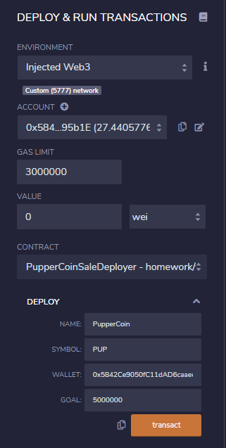
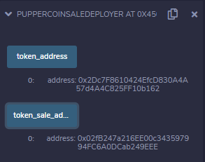
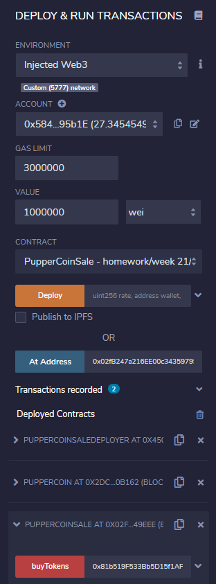
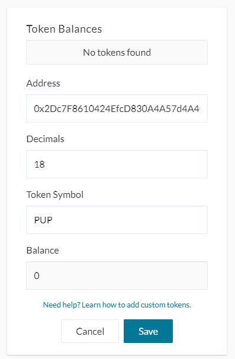
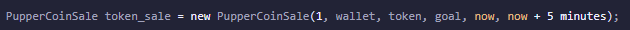

# Crowdsale
---
## Background  

This crowdsale contract will manage the entire process, from receiving ETH, to minting PupperCoin and sending it to the buyers.
Ultimately this crowdsale will need to be conducted on a testnet such as Kovan or Ropsten. However, for the purposes of this demonstration localhost was used.

---
## Deploying the Crowdsale  
1. Deploy the PupperCoinSaleDeployer contract by providing a Name, Symbol, Wallet address and funding Goal  

2. Deploy PupperCoin with the token_address  

3. Deploy PupperCoinSale with the token_sale_address

## Sending Ether

## Adding PupperCoin to MyCrypto
1. Access your wallet
2. Scroll to Token Balances
3. "Add Custom token"
4. Inputting the token address will automatically fill the remaining fields  

## Testing functionality
* Time functionality  
You can test the time functionality by replacing now with fakenow, and creating a setter function to modify fakenow to whatever time you want to simulate. You can also set the close time to be now + 5 minutes, or whatever timeline you'd like to test for a shorter crowdsale.  

